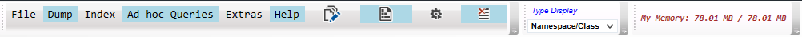

#### MDRDesk
[Up](../README.md)
## Main Menu

#### File
**Open Report File...**  
Open and display report file, the text files with MDRDesk's custom formatting.
Some query results tabs can generate these reports, see FileReport or FileReportShort.

**Exit**  
Exits application.

#### Dump
**Crash Dump Required Dac...**  
		The file browser dialog is shown. Select a crash dump, and it's required dac file name
        will be displayed in the message box, and copied to the clipboard.

**Add Dac File...**  
        To make easier to place a dac file in our private folder (mscordacwks).
		Not implemented yet...

**TryOpenCrashDump**  
		Just to see if a crash dump can be opened. This is to confirm that we can find the proper adc file and the crash dump is not severly corrupted.

**Dump Local Process...**  
		Shows dialog with the list of running processes (on the local machine).
        After selecting one, you can generate its crash dump.
		NOTE: the process list is not updated, so new procceses started after the dialog is shown are not listed.
        [See details](../Documentation/DumpLocalProcess.md)

#### Index
**Create Dump Index...**  
Select a crash dump file in the File Dialog. Indexing will start, and the newly created index will be opened.
The folder [crash dump name].map is created in the dump's directory containing the index files.  
If indexing is not successful, error message is displayed. Please copy the message and open the issue on the github site.
The Message Dialog has the copy icon in the left-bottom corner.

**Open Dump Index...**  
Select an index directory ([crash dump name].map) in the Folder Dialog. Loading index files might take a while.  
If the index cannot be opened, error message is displayed. Please copy the message and open the issue on the github site.
The Message Dialog has the copy icon in the left-bottom corner.

**Close Current Index...**  
Closes an opened index, and hopefully releases all its resources.
Actually you can also select another index if you have one already opened.
The old one will be closed and the new one will be loaded.

**Show Indexing Report...**  
The tab titled Indexing will be shown with all indexing actions.
This tab is visible if an index is loaded immediately after the indexing.

**Show Loaded Modules...**  
Displays the list of module basic informations.

**Show Finalizer Queue...**  
Displays the list of module basic informations.

#### Ad-hoc Queries
Various utilities/tests normally not used by a regular user.
I'll add information if something practical is added there.

#### Help  
Show the help content in a local window. This should look the same as documentation on the github site.

*Write report file, from a current tab.*  
The contemt of some displayed tabs can be transformed into a specially formatted text file.
This report file can be opened using Open Report File. WARNING: Not fully implemented yet.

*Write csv file, from a current tab.*  
The contemt of some displayed tabs can be transformed into a specially formatted csv file.
The separator character is: '\uFF1B' (FULLWIDTH SEMICOLON). How to type in Microsoft Windows: Alt +FF1B.
This report file can be opened using for ex.: Excel, specifying separator character. WARNING: Not fully implemented yet.

*MDRDesk settings/configuration.*  
View/modify MDRDesk setup. This maps directly MDRDesk.exe.Config, MDRDesk32.exe.Config files.
[See details..](../Documentation/Configuration.md)

*Force GC*  
Forces MDRDesk's full GC collection with compaction and finalization.

*How to display type list.*
Instances (list of heap instances) tab content can be displayed in 3 ways:  
(1) Namespace/Class -- the first column displays namespaces, the second one all classes which belong to the namespace.  
(2) Class/Namespace -- the type list is sorted by class name, and its namespace follows after a star character.  
(3) Full Name -- the type full name list is displayed.

  
Current MDRDesk usage of memory: private working set, and peak working set are displayed.

##### Hot Keys

Alt + V -> Get instance value, shows a dialog where you have to enter an instance address.  
Alt + R -> Get instance references, shows a dialog where you have to enter an instance address.  
Alt + H -> Show instance hierarchy, shows a dialog where you have to enter an instance address.  

Ctrl + O -> Opens most recent index, same as clicking on the first item in Index -> Recent Indices menu item.
